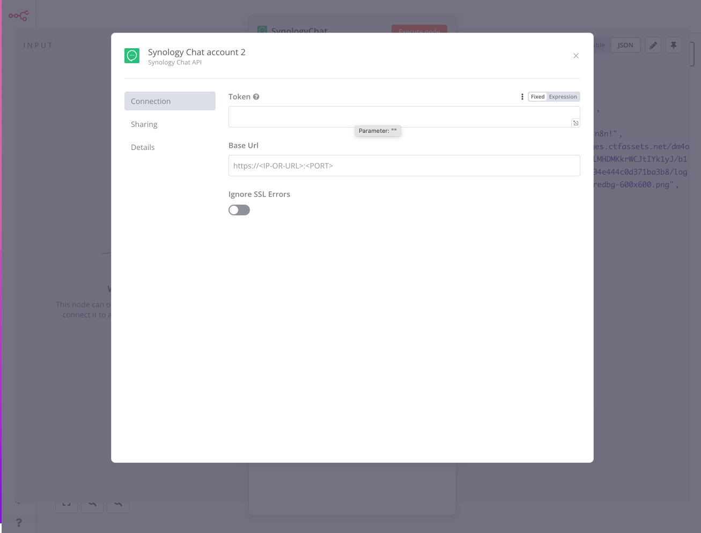
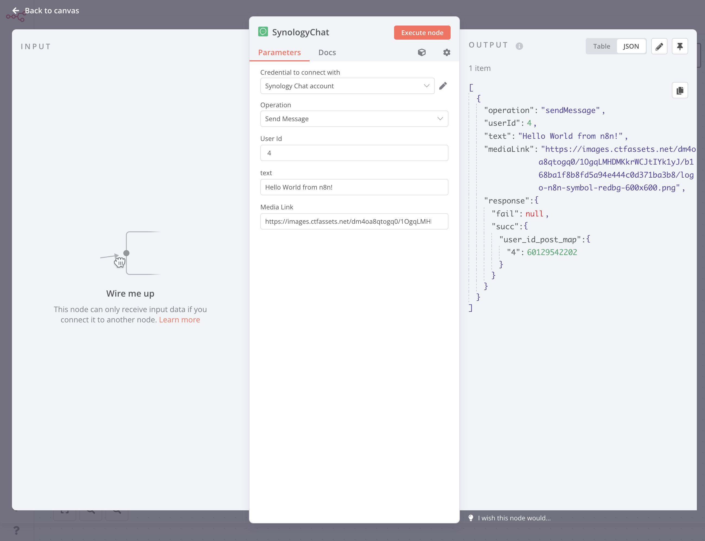
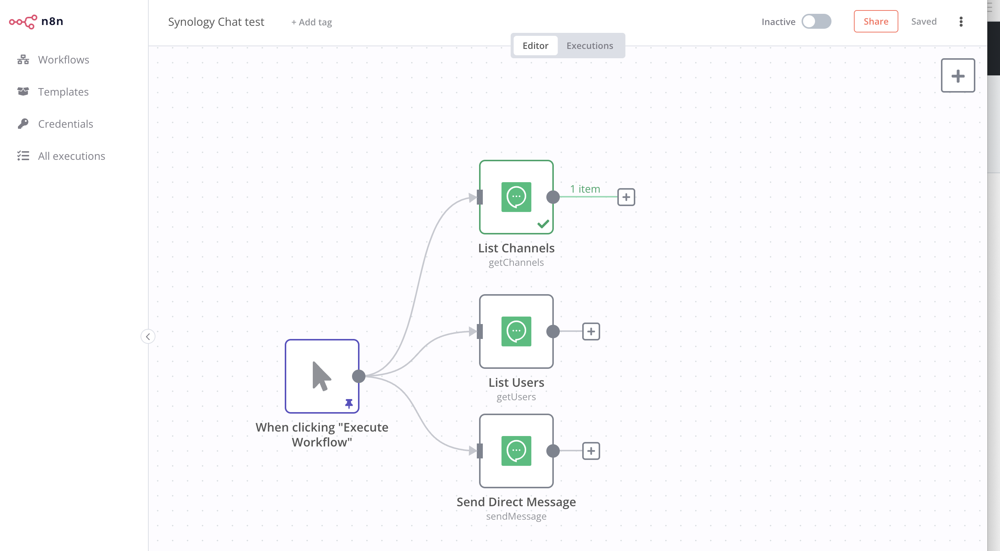

<h1 align="center">
  n8n-nodes-synology-chat
</h1>

  N8N node for Synology Chat

  
  
  
  

## About 
This is an n8n community node. It lets you use Synology Chat in your n8n workflows.

Synology Chat allows you to communicate easily and securely with an all-in-one, license-free, and private cloud messaging service.

[n8n](https://n8n.io/) is a [fair-code licensed](https://docs.n8n.io/reference/license/) workflow automation platform.

[Installation](#installation)  
[Operations](#operations)  
[Credentials](#credentials)  <!-- delete if no auth needed -->  
[Compatibility](#compatibility)  
[Usage](#usage)  <!-- delete if not using this section -->  
[Resources](#resources)  
[Versions](#Versions)

## Installation

Follow the [installation guide](https://docs.n8n.io/integrations/community-nodes/installation/) in the n8n community nodes documentation.

## Operations

- Send Message to any user in the Chat including rich media options.
- Generate a list of all the available channels for the robot
- Generate a list of all the available users for the robot

### Notes

It can't listen for changes/responses or participate in channels (yet).

By default includes the support for non-valid SSL Synology instances, [see](https://github.com/UlisesGascon/n8n-nodes-synology-chat#disable-ssl-validation)

## Credentials

You will need to create a new integration in Synology chat `User Profile > Integration`, [full documentation](https://kb.synology.com/en-us/DSM/tutorial/How_to_configure_webhooks_and_slash_commands_in_Chat_Integration#x_anchor_id5)

You will need to include the details in the credentials sections

## Compatibility

Tested against n8n v0.215.1

## Usage

This Node will help you to send messages to specific users in the chat. 

### Setup

### Simple Example

## Resources

* [n8n community nodes documentation](https://docs.n8n.io/integrations/community-nodes/)
* [Synology Chat](https://www.synology.com/en-us/dsm/feature/chat)
* [Synology Chat Chatbot Documentation](https://kb.synology.com/en-us/DSM/tutorial/How_to_configure_webhooks_and_slash_commands_in_Chat_Integration#x_anchor_id5)

## Versions

| n8n-nodes-synology-chat version | synology-chat-communicator version | Changelog |
|----------|:-------------:|------:|
| 1.0.0 |  1.0.0 | [synology-chat-communicator@1.0.0](https://github.com/UlisesGascon/synology-chat-communicator/releases/tag/v1.0.0) |
| 1.1.0 |  1.1.0 | [synology-chat-communicator@1.1.0](https://github.com/UlisesGascon/synology-chat-communicator/releases/tag/v1.1.0) |
    